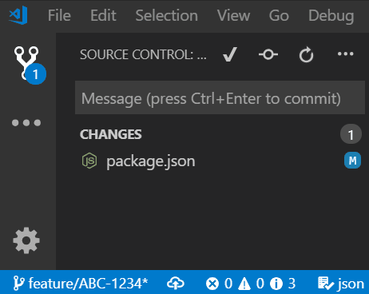

# Git Prefix

## New in 1.3.0
Setting `Is Suffix` appends at end of commit message.

## Features
Button to run `Git Prefix Commit Message` command:

Insert a value from the current branch name into the Source Control Git Message box.

## Usage

- Open the Command Palette `Ctrl+Shift+P` (`Cmd+Shift+P` on macOS)
- Type `Git Prefix Commit Message` and hit `return`
- The matching branch pattern is prefixed in the Git Message box

## Extension Settings

This extension contributes the following settings using JavaScript regular expression syntax:

* `gitPrefix.pattern`: Regular expression pattern to match in the branch name. Default matches
entire branch name.
  > Tip: Match a ticket in a branch created by Jira using a pattern such as: `.*(TEST-\d+).*`

* `gitPrefix.isSuffix`: Suffix expression instead of prefixing it.  Default is `false`.
* `gitPrefix.patternIgnoreCase`: Ignore case in pattern.  Default is `false`.
* `gitPrefix.replacementIsFunction`: If true, the replacement string is a function return expression where parameters (p1, p2, p3, etc.) correspond to the matching patterns $1, $2, $3, etc.. Default is false.
  > Example : p1 + (p3 ? \`(${p2}): ${p4.replace(/-/g, ' ')}\` : p2.replace(/-/g, ' '))
* `gitPrefix.replacement`: Regular expression replacement string to place into commit message. Default is `"[$1] "`.

## Replacement Tokens

There's a few replacement tokens the extension provides in order to let your messages be a little bit more fluid.

* `[folder]`: the folder name of the root of the repository that is currently active
* `[parentFolder]`: the folder name of the parent folder of the root of the repository that is currently active

These can be used in the `gitPrefix.replacement` value.
  > Example : `"[$parentFolder/$folder/$1] "`

**Happy Committing!**
